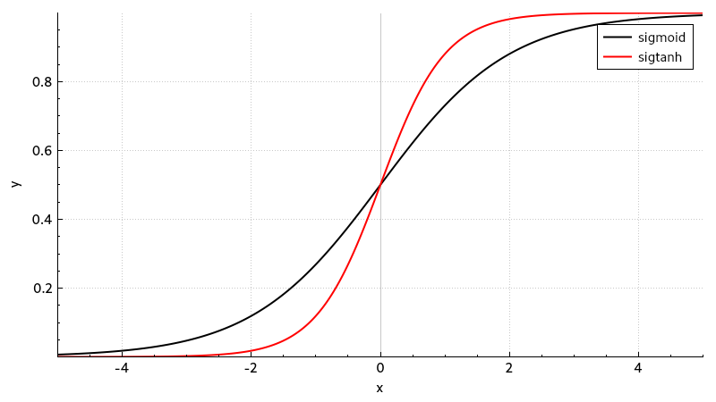

# Exercise 5

## Activation Functions
The following plot shows the two given activation functions.
They are looking very similar to each other and differ only in their growth rate.
Based on the given discrete learning problems it seems to be a good idea to choose the function `sigtanh` as the activation function, because it approximates the Heaviside step function much better.
With this choice I would expect a faster learning procedure.

